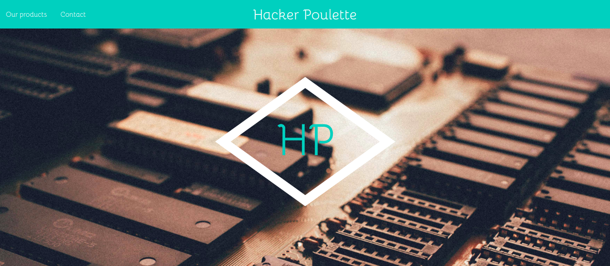

# Hackers Poulette

## Présentation du Projet

Projet créé le 02 Décembre 2019 dans le cadre de la formation Web Developer donnée par [BeCode](https://www.becode.org/), dans le but d'améliorer nos compétences en PHP, en HTML et SASS, en git et en gestion de travail de groupe.

Le projet est réalisé sur base des [instructions données](https://github.com/becodeorg/CRL-Woods-2.15/tree/master/Projects/HackersPoulette).

- [x] HTML validated by [W3C Validator](https://validator.w3.org/)
- [x] JavaScript formatted with [Prettier](https://prettier.io/)
- [x] PHP formatted with [PHP cs fixer](https://github.com/FriendsOfPHP/PHP-CS-Fixer)

### **[Hackers Poulette](https://github.com/kevin-labtani/projet-formulaire)**

Le Projet consiste en un site _one-page_ présentant la société **Hackers Poulette**, vendeuse de kits et accessoires pour Raspberry Pi.

## Contributeurs

- [**Kevin Labtani**](https://github.com/kevin-labtani)
- [**Loic Lissens**](https://github.com/LoicLissens)

## Langages et technologies.

- PHP
- JavaScript
- HTML
- SASS

Le site est implémenté avec le framework CSS [**MaterializeCSS**](https://materializecss.com/).

Le formulaire de contact est validé en front-end avec du _HTML5_ et du _JavaScript_, et est ensuite validé et sanitisé en back-end avec du _PHP_.

## Progression

Projet terminé le 06 Décembre 2019.

## Remerciements

- [BeCode](https://www.becode.org/) pour la formation.
- [Arnaud Duchemin](https://github.com/Cervant3s) pour le coaching.
- La promotion **CRL-Woods-2.15** pour l'aide et le support.
